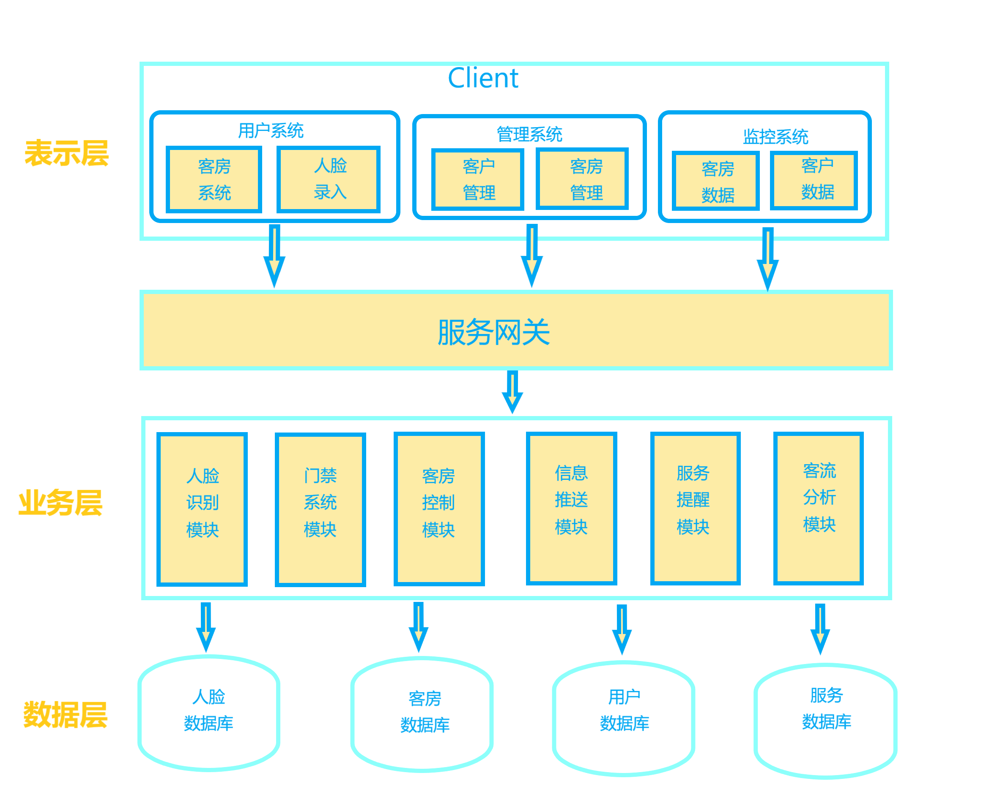

# 系统架构

## 三层C/S模型

这个智能酒店管理系统的参考架构以微服务架构（Microservices Architecture）作为基础。微服务架构通过将一个大型系统拆分为许多小型、独立、可维护的服务来实现功能。每个服务负责实现一个明确的功能，这些服务可以通过API或消息传递进行通信。这种架构在提供敏捷性、可伸缩性和容错性方面具有一定优势。

### 表示层（Presentation Layer）
#### 与用户进行交互，并向用户提供可视化界面。该层主要包括用户界面和用户交互逻辑。  
用户Web界面:

提供网页端用户界面，允许用户进行在线预订、人脸录入、自助入住、控制客房设备等。  

酒店控制web界面:  

该界面用于向酒店管理人员展示统计到的用户消息和系统的运行情况，并允许管理人员配置系统的相关服务。  

人脸识别终端:  

设计直观的用户界面，用于展示采集人脸数据和视频数据。该界面应简洁易用，并提供必要的指导和反馈。  

使用技术和框架例如：

- HTML, CSS, JavaScript
- 前端框架：React, Angular, Vue.js 等。
- 前端库：Bootstrap 或者 Ant Design 等。

### 业务层（Business Layer）  
#### 处理客服和酒店的业务，并将其转换为具体的操作，包括人脸录入、快速入住、门禁控制、个性化欢迎、服务员提醒、安全监控、智能客房控制、信息推送等。该层通常包括业务逻辑处理器和服务。  
人脸识别模块：负责处理人脸录入、快速入住、人脸开门等功能。该模块应包括人脸采集、人脸特征提取、人脸比对等算法和逻辑，以实现准确的人脸识别功能。  

门禁系统模块：根据人脸识别模块的结果实现对门禁的控制。

客房控制模块：负责控制智能客房设备，如灯光、空调、窗帘等，以提高客房舒适度。该模块需要与客房设备进行通信，并提供相应的API或指令集，以实现对设备的控制和状态监测。  

信息推送服务模块：基于客户偏好和行为，推送个性化信息，例如餐厅推荐、天气预报等。该模块需要根据客户数据和行为分析，实现个性化推荐算法，并通过消息推送机制向客户发送相关信息。

服务员提醒模块：接收客户服务需求，提醒服务员及时响应客户需求，以提高服务效率。该模块可以通过即时通信技术（如WebSocket）实现服务员的消息提醒和响应，同时需要与服务员管理系统进行集成，以获取服务员的状态和位置信息。

客流信息分析模块：基于客房情况、时间段和客户情况，分析客流，

使用技术和框架例如：

- 后端编程语言：Python, Java, Node.js 等。
- 后端框架：Spring Boot,  Express 等。
- RESTful API 设计，便于前端与后端交互。
- 人脸识别技术：如OpenCV, FaceNet, AWS Rekognition等。

### 数据层（Data Layer）
#### 负责与数据库进行交互，并从数据库中检索和保存数据。该层包括数据存储和检索、数据访问对象等。数据访问层可以与多个数据库交互，包括人脸数据库和订单数据库等。
数据库组件：用于持久化存储系统数据，包括客户信息、订单、房间状态、客流分析信息和人脸数据等。

数据交换组件：负责处理与数据库的交互，包括数据的读取、写入、更新和查询等操作，并向业务层和表示层提供相关的接口服务。  

存储系统日志和监控信息：存储数据库的操作日志，以及状态的监控信息。

使用技术和数据库例如：

- 数据库类型：关系型数据库、非关系型数据库或混合类型。
- 具体数据库：MySQL, PostgreSQL, MongoDB, Redis 等。

### 架构迭代

### 表示层（前端）迭代：

- 对移动设备进行优化，适应不同屏幕尺寸和浏览器。
- 支持多语言界面，以适应国际化客户群体。
- 加入无障碍访问功能，提高用户体验和可访问性。

### 业务层（服务器端）迭代：

- 加入其他生物识别技术，如指纹识别、声纹识别等，作为人脸识别的补充，提供更高的安全性和准确率。
- 集成语音助手功能，使客人能够通过语音与房间（包括智能家居设备）互动。
- 引入机器学习算法，基于客户的数据搜集和接触点进行个性化推荐，提高客户体验。
- 通过API与其他第三方服务（如出租车预约、旅游景点推荐等）进行集成。

### 数据层（数据库）迭代：

- 使用数据仓库技术，以更好地分析酒店客流和业务运行数据。
- 针对不同数据类型选择合适的数据库技术，例如使用时间序列数据库，存储IoT设备数据等。
- 引入自动备份和恢复方案，提高数据安全性和稳定性。

### 云架构部署：

- 将系统部署到云平台（如AWS, Azure, GCP等），提高可扩展性和灵活性。
- 使用容器技术（如Docker）和容器编排工具（如Kubernetes），以便于部署、扩展和管理。
- 利用云服务进行存储、计算资源和人工智能服务等，减少硬件投资和维护成本。

### 安全性增强：

- 采用更严格的身份验证和授权机制，例如双因素认证。
- 定期对系统进行安全审计，并使用最新的加密技术。
- 保持系统和依赖项更新，以防范潜在的安全威胁。
